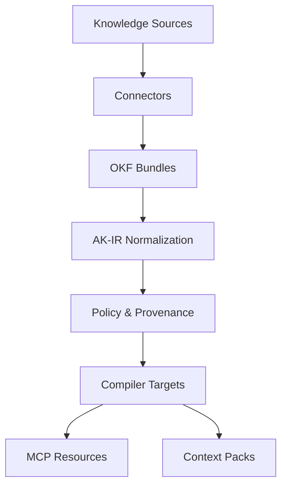

# The AKCP Compiler Pipeline

The Compiler Pipeline is the heart of AKCP. It translates raw, human-authored documents into deterministic artifacts that AI agents can consume.

AKCP transforms OKF knowledge sources into compiled artifacts through a deterministic 10-step pipeline.

## 1. Read Sources
Connectors (e.g., `OKFDirectoryConnector`, `OpenWikiConnector`) read raw files from the configured input locations.

## 2. Parse OKF Markdown
The `FrontmatterParser` extracts the YAML frontmatter and the Markdown body. Unknown keys and unknown types are preserved.

## 3. Normalize to AK-IR
Raw knowledge items are converted into `IRConcept` objects. `AgentKnowledgeIR` (AK-IR) acts as the central, normalized data model for all subsequent operations.

## 4. Validate
The pipeline runs validation rules over the AK-IR:
- Lifecycle freshness checks
- Capability injection detection
- Governance guardrails

## 5. Link Entities
Explicit markdown links and frontmatter references are extracted to build an Entity Graph (`IRLink`), enabling RAG systems to traverse relationships.

## 6. Attach Policy/Provenance
Provenance records are attached to concepts indicating source hash, URI, and generation time.

## 7. Optimize Context Budget
The pipeline estimates the token size of each concept and optimizes the total payload size based on target limits.

## 8. Emit Targets
The compiler iterates through the requested targets (`mcp-profile-server`, `context-pack`, `openwiki`, `agent-instructions`, etc.) and invokes their respective plugins to write output files.

## 9. Write Artifact Manifest
A manifest (`provenance.json` or `akcp-manifest.json`) is generated tracking exactly what was built, where it originated, and its checksums.

## 10. Run Conformance Checks
The compiler executes conformance rules against the built outputs to verify OKF spec adherence and profile requirements, reporting warnings or errors.
